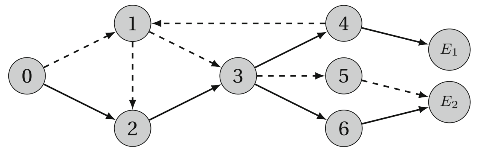
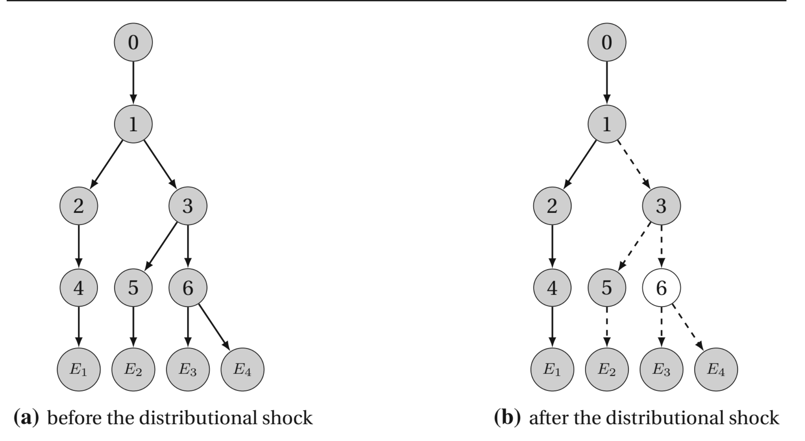
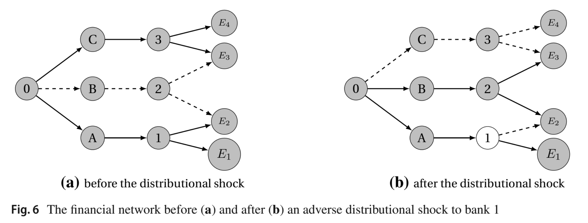
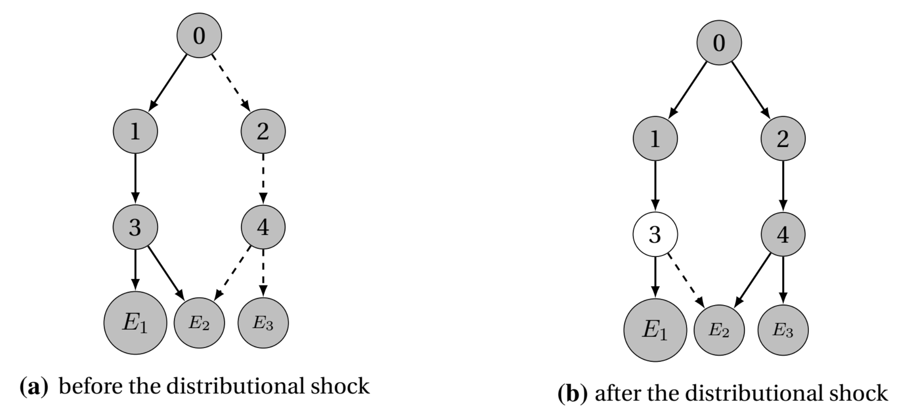
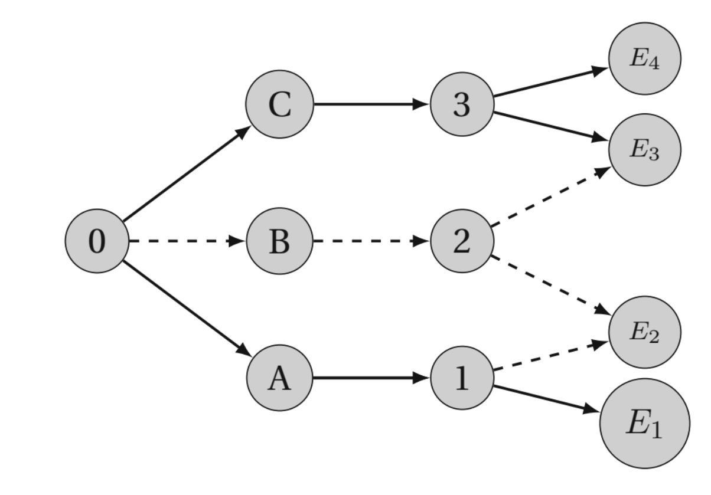

<!--
theme: gaia
class:
 - invert
headingDivider: 2 
paginate: true
-->

<!--
_class:
 - lead
 - invert
-->

# Systemic credit freezes in financial lending networks

Daron Acemoglu, Asuman Ozdaglar, James Siderius and Alireza Tahbaz-Saleh

2021 

## Introduction
- Credit freezes are induced by the fear of default contagion.
 
- Fears were visible before the collapse of Lehman Brothers.
  - After the run on Bear Stearns on March 12, 2008, Goldman Sachs, Credit Suisse, and Deutsche Bank froze their credit to Bear Stearns.

- Some financial institutions suffered credit freezes even though they did not have any direct counterparty exposure to Lehman Brothers.
  
## Contribution
- Develop a model of ex ante credit freezes.
- Analyzing subgame perfect equilibria of the lending and borrowing game.
- There exists a unique, strong equilibrium in pure strategies.
  - Deviating slightly from their equilibrium strategies, decisions are robust.
- Characterize different properties of credit freezes. 

## Model

- A representative depositor.
  - Access to unlimited funds.
  - Opportunity cost / risk-free rate.
 
- Banks.
  - Intermediate the depositor and the entrepreneurs.
  - Hold some assets. 
  - Have liquidity shocks, independently across banks.

- Entrepreneurs.
  - Access to profitable investment opportunities.

## Model
- Three periods:
  - t=0: Banks and depositors offer lending contracts, specifying fixed interest rates.
  - t=1: Banks and entrepreneurs decide the borrowing amount.
  - t=2: Debt due. Shocks are realized. 

- Agents at t=0 foresee the equilibrium at t=1,2.

## Model
- Banks repay nothing if they default.
  - Lenders have high incentives to freeze credit.

- There is an exogenous bankruptcy cost.
  - Have negative profits if banks default.
  
- If lenders cannot deliver the funds to their borrowers, they face a prohibitively large cost.
  

- There is intermediation friction.
  - The potential network is given: G.
- Restricted by G, agents decide the lending contract relationship.

## Equilibrium
Backward Induction.
- t=2: Repayment equilibrium/netowrk.
- t=1: 
  - Anticipating the repayment decisions at t=2.
  - Maximize the expected profits. 
    - Borrow exactly as much as they lend out.
    - Choose the lowest interest rates.
  - Borrowing equilibrium/netowrk.

## Equilibrium
- t=0:
  - Anticipating the borrowing and repayment equilibria at t=1 and t=2.
  - Maximize the expected profits.
  - Interest rate equilibrium/network.
  - Could have multiple subgame perfect equilibria.
    - Strong equilibrium: a variant of agent-form trembling-hand perfect equilibrium.

## Existence and Uniqueness
- For any network G:
  - There exists a repayment equilibrium for any financial network and any vector of shocks.
  - There exists a borrowing equilibrium for any given vector of interest rates.
  - There exists a strong equilibrium in pure strategies. 

## 
- For any network, if the shock distribution is generic, there is an essentially unique strong equilibrium in pure strategies.
  - the financial networks corresponding to all equilibria are equivalent.

- Any strong equilibrium is equilibrium to a strong equilibrium such that 
  - The common network of interest rate network and borrowing network is a directed tree.

## 

## Credit Freezes
- Credit freezes: a bank or entrepreneur does not obtain any lending contract offer.
- Systemic credit freezes: All entrepreneurs experience a credit freeze.

## Results: A Single entrepreneur.
- Always in the form of a single intermediation chain from the depositor to the entrepreneur.

- If G is a chain network, and the risk profile is symmetric,
  - then there is n* s.t. the economy experiences a system freeze if and only if n>= n*.

- Credit freezes are monotone and systemic.
  - An adverse shift in the distribution shocks can only lead to 
    - more credit freezes throughout the economy. 
    - less total lending.

## Results: Multiple entrepreneurs
- In the tree networks, credit freezes are "simple".
  -  Remain confined to the branch of network that experienced the adverse shift.

- Credit freezes may originate from the other branch of the network.

- The effects of adverse shifts can be non-monotonic.
  - Greater risks for some banks can increase overall lending

## Simple credit freezes.

## 

## Non-monotone.

## Policies
- Untargeted policies: provide liquidity to the depositor.
- Targeted policies: provide liquidity to the destressed agents.

## Policies
- In networks with a single entrepreneur, an untargeted policy is optimal.
- When credit freezes are simple, the best targeted policy is to help the branch of the network with banks experiencing a credit freeze.
- With complex freezes, optimal targeted policies may need to be directed to parts of the network not suffering from credit freezes.
- Direct lending to entrepreneurs may be more costly than the optimal targeted policy.

## Ineffective Policy

## Ineffective Policy

