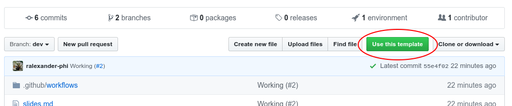

<!--
theme: gaia
class:
 - invert
headingDivider: 2 
paginate: true
-->

<!--
_class:
 - lead
 - invert
-->

# Systemic credit freezes in financial lending networks

Daron Acemoglu, Asuman Ozdaglar, James Siderius1 and Alireza Tahbaz-Saleh

2021 

##

## Model

Remember the branch and URL shown.

## Update Workflow

You'll update the workflow file over the next few slides. You can do this right in the GitHub web page (click on the pencil icon).

`.github/workflows/main.yml`

